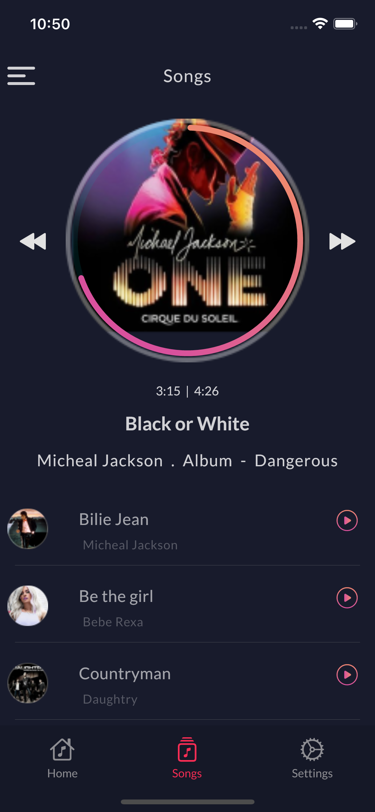

# Flutter Musiz Player

A sample UI of music player.

## Getting Started

This project is a created base on this [UI repository](https://www.xdguru.com/muzic-free-music-xd-ui-kit/).

You can see the designed pages below:

| Home | Songs | Settings | Drawer |
|  --- |  ---  |   ---    |   ---  |
|||||
